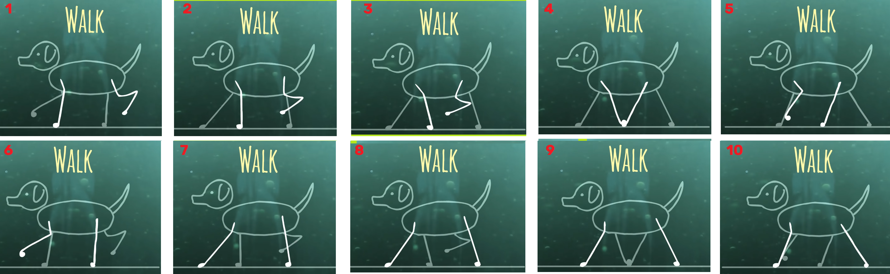
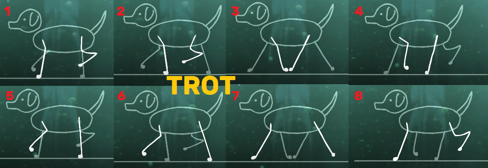
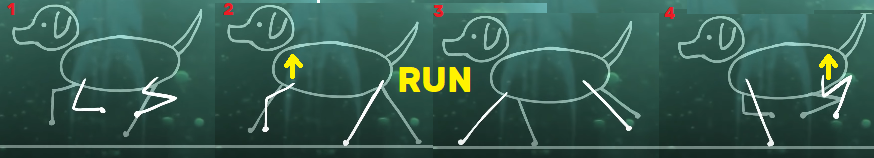
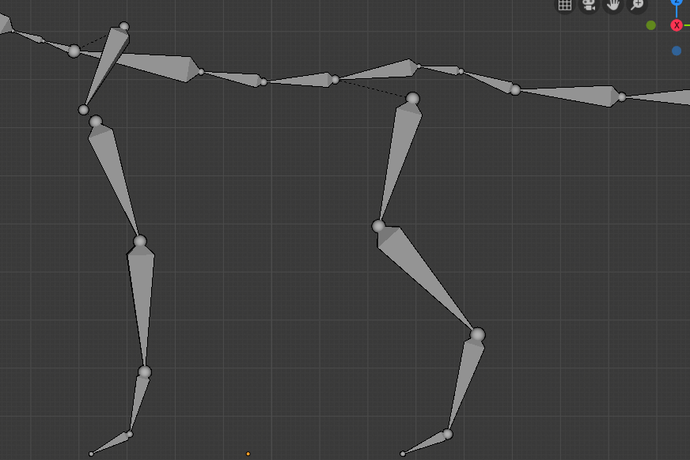

# Blender 2.8 cheatsheet :

*Cheatsheet I made from [Blender Fundamentals](https://www.youtube.com/playlist?list=PLa1F2ddGya_8V90Kd5eC5PeBjySbXWGK1) and [Blender Guru tutorials](https://www.blenderguru.com/tutorials/blender-beginner-tutorial-series)*

## Shortcuts
Hover anything in the UI and press F1 to display the documentation

`F3` : all commands search

### Camera :
- `Middle click drag` : rotate camera
- `Shift` + `Middle click drag` : move camera
- `Z` : wireframe mode / solid
- `.` (on num pad) : center view on the object
- `5` (num pad) : orthographic/perspective mode
- `1` : front
- `9` : oposite
- `0` : camera mode
- `T`/`N` : open left/right menu 
- `Tab` : object mode / edit mode (see vertices)

### Selection :
- `A` : unselect/select all
- `B` + `Left click drag` : Box select
- `B` + `Middle click drag` : Box unselect
- or `C` to circle select (wheel to zoom) 
- **Select edge loop**: `Alt` + `Left click`

### Manipulate :
- `G` : grab (right click = cancel)
- `G` then `Middle click drag` : Move along one of the 3 axis
- `R` : rotate (double R for free rotation mode)
- `S` : scale
- `Alt` + G/R/S : reset to origin
- `X` : delete
- `Left click` : place the reticule, it is the spawn point
- `Shift` + `A` : add menu (or click on the left menu)

### View :
- `H` : hide object (alt+H unhide all) or use scene view on the top right
- `M` : move object to layer (see layers panel in the bottom)
- `Ctrl` + `down` : fullscreen 3D view
- Split view : Drag the top right corner of the view **inside** the view
- Collpase view : Drag the top right corner over an other view (**outside** the current one)
- `Alt` + `B` + select area: "Box view" to display only the selected area (`Alt` + `B` to leave this view)

### Object Mode :
- **Merge meshes**: select objects and `Ctrl`+`J`
- **Duplicate**: `Shift`+`D` 
- Camera **fly mode**: `Shift`+`F`
- **Prefab**: `Alt`+`D` (create a new instance of an object instead of a duplicate)

### Edit Mode :
*There is an undo history in object mode **and** one in edit mode*
- **Reset cursor** to origin: `Shift` + `C` (`Shift` + `S` for the contextual menu)
- Mesh **select mode** (face,vertex,edge): `Ctrl` + `Tab` (in edit mode) :
- **Extrude** tool: `E` (or `Ctrl`+`Left click`)
- **Loop cut** (add vertices to middle of object): `Ctrl` + `R`
- Loop cut **only on a wanted part**: Select all the faces you don't want the cut, hide them with `H` then do loop cut. Unhide with `Alt` + `H`.
- **Select edge loop** *(created with a loop cut)*: `Alt` + `Left click`
- **Create face** (or **edge**) from the multiple points selected: `F`
- "**Cursor to selected**" or "**Selection to cursor**": `Shift`+ `S`
- Select "[Proportional Editing mode](https://docs.blender.org/manual/en/dev/editors/3dview/object/editing/transform/control/proportional_edit.html)" to "Connected" to move **nearby elements** *(scroll while moving to change the radius of the proportional editing influence)*
- **Merge**: `Alt` + `M`
- **Fill** with triangles: `Alt` + `F`
- Select all vertices **linked** to this object: `L` (when hovering object)
- `P` : **Separate** the selected vertices into a new mesh (a new object)
- Select then `double G` : Moving along the edge
- **Add vertex**: Select edge or face, `Right clic` > `Subdivide`
- **Merge 2 shapes**: Select 2 edge loops, `Right clic` > `Bridge Edge Loops`

### Sculpt mode:
- **Opposite effect**: Press `Ctrl` while sculpting to do the opposite effect of current brush
- **Smoothing**: Press `Shift` while sculpting
- **Scale** the brush: `F`
- **Strenght** of the brsuh: `Shift`+`F`

## Modifiers *(Wrench icon)*
- Bevels : To round corner, make things more realistic. (Add modifier -> Bevel)
- Subsurf : Virtually add  points to the mesh, following the curves of the object, to smooth it
- Mirror : Apply symmetry (Check Merge and Clipping)
- Solidify : Add Thickness to a mesh

## Tools
- Smooth : Tools > Shading > Smooth
- Remove doubles
- [Spin](https://docs.blender.org/manual/en/dev/modeling/meshes/editing/duplicating/spin.html) (don't forget to "Remove Doubles")

## Texturing/Unwrapping
### Add texture
1. Switch to "Cycles Render" mode
2. Add material => Surface "Diffuse BSDF" => Color "Image texture" and choose file
3. Switch to "Texture" view mode

### UV Unwrap
1. Select edges (`Alt`+`Left click`)
2. `Ctrl`+`E` => "Mark Seam"
3. Select all in Edit Mode (`A`) => `U` => "Unwrap"
4. Open a second view "UV/Image Editor"
5. `N` => Check "Stretch" to see where the unwrapping is stretched *(try to avoid stretches)*

- **Export the UV layout:** in the UV view, select all (in edit mode), go to "UVs" menu => "Export UV Layout"
- **Painting directly on the object:** After added a texture image, go to "Texture Paint" *(instead of "Edit Mode")*
- **Sync selection**: Click the "cursor on cube" icon in the "UV/Image Editor"

## Animation
### IKeys / IPO
- I : Insert key (place the cursor on the 3D view)
- Change **interpolation**: Layout "Animation" > select all curves > Key > Interpolation Mode
- [Walking animation key frames](https://youtu.be/sTo4adwvulE?t=1m18s)
- Paste **reverse animation**: (select bones, `Ctrl`+`C` then) `Ctrl` + `Shift` + `V`
- Change animation **speed**: Go to "Dopesheet Editor", make the first frame the current frame, select all keyframes `A` and scale `S`
- **Copy** an animation from another object that has the same armature: `File` > `Append` > Select the file that has the animation > `Action` > Pick the animation
- **Delete** all animations: In the **Outliner** panel, select **Blender File** mode then delete all under the `Actions` bullet point

Keyframes of [quadruped animation](https://youtu.be/yl3IX6hgNss?t=226):

Troting (up on frames 3 and 7, down on frames 1 and 5)

Keyframes of [quadruped up and down body](https://youtu.be/INQx-Lzs8mU?t=47) while walking:

[Dog Run Cycle](https://www.youtube.com/watch?v=6uB2a2K6HGI)

### Rigging/Skinning ([tutorial](https://www.youtube.com/watch?v=8mZtc33rQ3c))
- `Shift` + `A` : Add armature
- In the armature "Object Data" menu, check `In Front`
- Extrude the tail of the armature
- For the legs and arms:
    * `Shift`+`A` to add a bone (in armature, edit mode)
	* Select the child (leg) then `Shift` + select the parent (hips)
	* Parent them: `Ctrl`+`P` > "Keep offset"
- For a [quadruped](https://youtu.be/0IB5KCPmEEI?t=245), 5 bones for the front legs, 4 bones for the rear legs (see the image below)
- Name the bones with `.L` (or `.R`) suffix to symmetrize them
- **Symmetrize** bones: Name bone with ".L" or ".R" suffix, select the bones, menu `Armature` => `Symmetrize` (do the bone constraints before)
- Parenting : Select the Mesh Object **then** Armature > `Ctrl+P` > "Armature deform with auto weights"
- `Ctrl` + `Tab` : Switch to Pose Mode and move the bones
- **Reset bones position** in Pose Mode: Select bones and `Alt` + `R`

- IK Bone and constraints: [Watch this](https://youtu.be/8mZtc33rQ3c?t=4m14s) : add IK Bone (no parent) + add constraint Inverse kinematic
- Select Armature then shift+select mesh and switch to **Weight Paint** mode. Activate the symmetry in the right "Tool" tab. Select each bone (by Shift clicking it) then adjust its weight.
- **Recalculate bones roll**: Set view to front `1`, select all bones `A`, `Shift`+`N` > "View Axis"

### [Bones constraints](https://youtu.be/Q9f-WVs3ghI?t=301)
Legs Inverse Kinematic:
- **Extrude** a new bone from the **ankle** to the rear *(name it Target)*, uncheck "Deform") and `Alt`+`P` > Clear Parent
- **Extrude** a new bone from the **knee** to the front *(name it Pole)*, uncheck "Deform" and `Alt`+`P` > Clear Parent
- Switch to **pose mode**, select the last leg bone (Leg02?) (before the foot), then in "Bone Contraint" tab, add "Inverse Kinematic"
- Set "Chain length" to the number of bones in the chain (from the root)
- Set the **Target** and the **Pole** to the previously created bones
- Adjust the Pole Angle (usually 90°)

Legs IK (prevent dislocation):
- Create a bone under the foot (no parent, not deform) *(name it Foot_Ctlr)*, at the level of the ground (Z=0)
- Parent the *Target* bone to the *Ctrlr* bone (Select Target, Shift+Select Ctrlr, `Ctrl`+`P` > Keep offset)
- Parent the *Foot* bone to the *Ctrlr* bone
- In pose mode, select *Leg02* (before the foot), shift+select the foot, `Shift`+`Ctrl`+`C` (add constraints with targets) > Copy Location
- In the constraints settings, slide Head/Tail to Tail
- Hide all the leg bones except the Ctrlr

[Head IK](https://youtu.be/0IB5KCPmEEI?t=809):
- Duplicate Head bone (same position), name it Head.Target
- Scale down the real Head bone
- Parent Head to Head.Target
- Clear parent of Head.Target, parent it to the shoulder base instead (so the head will move when the base move)
- Add IK constraint to the Neck (etc...)
- Select Neck, shift+select Head, `Shift`+`Ctrl`+`C` > Copy Location > slide Head/Tail to Tail

[Tail IK](https://youtu.be/0IB5KCPmEEI?t=951) (wiggle effect):
- Duplicate Tail01, name it Tail.Ctrl then scale it up to the tail size
- Parent Tail01 to Tail.Ctrl
- Select Tail.Ctrl, shift+select Tail02,  `Shift`+`Ctrl`+`C` > Copy Rotation (repeat for each tail bone and adjust the influence value)

Settings:
- To adjust the min/max rotation of each bone, adjust the settings under "Inverse Kinematic" in the bone tab

## [Normal map baking](https://docs.blender.org/manual/en/2.80/render/cycles/baking.html#bpy-types-bakesettings)
- Make a high poly version of your low poly model (with the exact same origin)
- Sculpt the high poly version
- Select the low poly and add an image node to it's material (for the normal map)
- Select the **High Poly first** THEN the low poly, go to "Render" left tab, "Bake Type: Normal", check "Selected ot active", click Bake
- If there are green parts in the normal map, adjust the Ray Distance or use a Cage

> Blender bake using a ray casting. If the ray distance is 0, the ray starts from the lowpoly surface. So, if this surface is inside the highpoly mesh, the ray meets nothing.
> With a higher value for the ray distance the ray starts farther to the outside of the lowpoly so that it can hit the highpoly surface.
> Practically speaking you may need to tune this value (not too high, not to low) so that the ray does not hit unwanted surfaces of the highpoly mesh.

## [Before exporting to Unity](https://gamedevacademy.org/how-to-import-blender-models-into-unity-your-one-stop-guide/)
- Delete camera and lamp
- Apply transforms : `Ctrl` + `A` - Apply rotation and scale
- Set the origin correctly (`Shift`+`C` to reset cursor then `Ctrl`+`Alt+`Shift`+C > "Origin to 3D cursor")
- Recalculate normals: in Edit Mode, select all faces then `Ctrl`+`N`
- Reset the pose mode and select the `_default` pose (create a `_default` pose with just one frame in the normal position. Start with an underscore so it will be first in alphabetic order and Unity will show it as a default pose).
- Export Settings:
  - "Selected objects"
  - "Apply scale: **FBX All**"
  - !EXPERIMENTAL! Apply Transform

## Sculpt low poly character from scratch
- [Add image](https://www.dimensions.guide/browse/animals): `Shift`+`A` -> Image -> Background (Rotate it 90° X)
- **Add Plane**: `Shift`+`A` -> Mesh -> Plane
- **Left ortographic** view: `3` `9`
- **Extrude the plane** (`E`) all over the base of model *(no legs, or symetrical members)*
- **Extrude the whole mesh** towards the camera *(on the Z axis)*
- **Delete the faces** (`X`) that are at 0° on the Z axis
- **Apply Rotation**: Switch to Object mode -> `Ctrl`+`A` -> Rotation
- **Add modifier** *(Wrench icon on the right panel)* -> Mirror -> Check **X Axis** only and **Clipping**
- **Add a loop cut** on the Y axis for the legs (`Ctrl`+`R`)
- **Extrude the legs**

- F3 => Shade flat 	

## Texture Paint
- **Paint Mask**: Click the "square icon" in top left in Texture Paint view. Switch to Edit mode, select faces you want to paint, switch to object mode, paint.

## Vertex Paint
- **Fill face**: in edit mode, select the wanted faces. Switch to "Vertex Paint" mode, select "Paint mask", select a color, hit `Shift+K` (useful to use it as id map in Substance/Mixer)

## [Shader](https://www.blenderguru.com/tutorials/2017/6/21/how-to-use-blenders-new-ultimate-shader-principled-bsdf)
- Metallic: It's 0 or 1 (is it metallic or not?)
- Roughness: 0 = lot of reflection ; 1 = No reflection

## Addons
- F2: to fill gaps
- LoopTools

## Useful
- Lissage : Smooth or Subsurf (apres un lissage, sélectionner tous les points et Ctrl+N pour recalculer les normales)

- Addons to test for Unreal:
  - Mr mannequin
  - Auto Rig Pro
  - Uefy
  - mb-lab addon (create humans)
  - Advanced Locomotion System V4 (ALS4) ue4
  - AutoRig+ALS4 => https://www.youtube.com/watch?v=oNDF2zpICxE
  - Manualy => https://www.youtube.com/watch?v=nY4Q8cYBLP8

- Export to Unreal:
  - Unit: 0.01m
  - Axis

List of IOR values for various materials

- Acetone 1.36 
- Actinolite 1.618 
- Agate 1.544 
- Agate, Moss 1.540 
- Air 1.0002926 
- Alcohol 1.329 
- Alexandrite 1.745 
- Aluminum 1.44 
- Amber 1.546 
- Amblygonite 1.611 
- Amethyst 1.544 
- Anatase 2.490 
- Andalusite 1.641 
- Anhydrite 1.571 
- Apatite 1.632 
- Apophyllite 1.536 
- Aquamarine 1.577 
- Aragonite 1.530 
- Argon 1.000281 
- Asphalt 1.635 
- Augelite 1.574 
- Axinite 1.675 
- Azurite 1.730 
- Barite 1.636 
- Barytocalcite 1.684 
- Benitoite 1.757 
- Benzene 1.501 
- Beryl 1.577 
- Beryllonite 1.553 
- Brazilianite 1.603 
- Bromine (liq) 1.661 
- Bronze 1.18 
- Calcite 1.486 
- Cancrinite 1.491 
- Carbon Dioxide (gas) 1.000449 
- Carbon Disulfide 1.628 
- Carbon Tetrachloride 1.460 
- Cassiterite 1.997 
- Celestite 1.622 
- Cerussite 1.804 
- Ceylanite 1.770 
- Chalcedony 1.530 
- Chalk 1.510 
- Chalybite 1.630 
- Chlorine (gas) 1.000768 
- Chlorine (liq) 1.385 
- Chrome Green 2.4 
- Chrome Red 2.42 
- Chrome Yellow 2.31 
- Chromium 2.97 
- Chrysoberyl 1.745 
- Chrysocolla 1.500 
- Chrysoprase 1.534 
- Citrine 1.550 
- Clinozoisite 1.724 
- Cobalt Blue 1.74 
- Cobalt Green 1.97 
- Cobalt Violet 1.71 
- Colemanite 1.586 
- Copper 1.10 
- Copper Oxide 2.705 
- Coral 1.486 
- Cordierite 1.540 
- Corundum 1.766 
- Crocoite 2.310 
- Crystal 2.00 
- Cuprite 2.850 
- Danburite 1.633 
- Diamond 2.417 
- Diopside 1.680 
- Dolomite 1.503 
- Dumortierite 1.686 
- Ebonite 1.66 
- Ekanite 1.600 
- Elaeolite 1.532 
- Emerald 1.576 
- Emerald, Synth flux 1.561 
- Emerald, Synth hydro 1.568 
- Enstatite 1.663 
- Epidote 1.733 
- Ethanol 1.36 
- Ethyl Alcohol 1.36 
- Euclase 1.652 
- Feldspar, Adventurine 1.532 
- Feldspar, Albite 1.525 
- Feldspar, Amazonite 1.525 
- Feldspar, Labradorite 1.565 
- Feldspar, Microcline 1.525 
- Feldspar, Oligoclase 1.539 
- Feldspar, orthoclase 1.525 
- Fluoride 1.56 
- Fluorite 1.434 
- Formica 1.47 
- Garnet, Almandine 1.760 
- Garnet, Almandite 1.790 
- Garnet, Andradite 1.820 
- Garnet, Demantoid 1.880 
- Garnet, Grossular 1.738 
- Garnet, Hessonite 1.745 
- Garnet, Rhodolite 1.760 
- Garnet, Spessartite 1.810 
- Gaylussite 1.517 
- Glass 1.51714 
- Glass, Albite 1.4890 
- Glass, Crown 1.520 
- Glass, Crown, Zinc 1.517 
- Glass, Flint, Dense 1.66 
- Glass, Flint, Heaviest 1.89 
- Glass, Flint, Heavy 1.65548 
- Glass, Flint, Lanthanum 1.80 
- Glass, Flint, Light 1.58038 
- Glass, Flint, Medium 1.62725 
- Glycerine 1.473 
- Gold 0.47 
- Hambergite 1.559 
- Hauynite 1.502 
- Helium 1.000036 
- Hematite 2.940 
- Hemimorphite 1.614 
- Hiddenite 1.655 
- Howlite 1.586 
- Hydrogen (gas) 1.000140 
- Hydrogen (liq) 1.0974 
- Hypersthene 1.670 
- Ice 1.309 
- Idocrase 1.713 
- Iodine Crystal 3.34 
- Iolite 1.548 
- Iron 1.51 
- Ivory 1.540 
- Jade, Nephrite 1.610 
- Jadeite 1.665 
- Jasper 1.540 
- Jet 1.660 
- Kornerupine 1.665 
- Kunzite 1.655 
- Kyanite 1.715 
- Lapis Gem 1.500 
- Lapis Lazuli 1.61 
- Lazulite 1.615 
- Lead 2.01 
- Leucite 1.509 
- Magnesite 1.515 
- Malachite 1.655 
- Meerschaum 1.530 
- Mercury (liq) 1.62 
- Methanol 1.329 
- Moldavite 1.500 
- Moonstone, Adularia 1.525 
- Moonstone, Albite 1.535 
- Natrolite 1.480 
- Nephrite 1.600 
- Nitrogen (gas) 1.000297 
- Nitrogen (liq) 1.2053 
- Nylon 1.53 
- Obsidian 1.489 
- Olivine 1.670 
- Onyx 1.486 
- Opal 1.450 
- Oxygen (gas) 1.000276 
- Oxygen (liq) 1.221 
- Painite 1.787 
- Pearl 1.530 
- Periclase 1.740 
- Peridot 1.654 
- Peristerite 1.525 
- Petalite 1.502 
- Phenakite 1.650 
- Phosgenite 2.117 
- Plastic 1.460 
- Plexiglas 1.50 
- Polystyrene 1.55 
- Prase 1.540 
- Prasiolite 1.540 
- Prehnite 1.610 
- Proustite 2.790 
- Purpurite 1.840 
- Pyrite 1.810 
- Pyrope 1.740 
- Quartz 1.544 
- Quartz, Fused 1.45843 
- Rhodizite 1.690 
- Rhodonite 1.735 
- Rock Salt 1.544 
- Rubber, Natural 1.5191 
- Ruby 1.760 
- Rutile 2.62 
- Sanidine 1.522 
- Sapphire 1.760 
- Scapolite 1.540 
- Scapolite, Yellow 1.555 
- Scheelite 1.920 
- Selenium, Amorphous 2.92 
- Serpentine 1.560 
- Shell 1.530 
- Silicon 4.24 
- Sillimanite 1.658 
- Silver 0.18 
- Sinhalite 1.699 
- Smaragdite 1.608 
- Smithsonite 1.621 
- Sodalite 1.483 
- Sodium Chloride 1.544 
- Sphalerite 2.368 
- Sphene 1.885 
- Spinel 1.712 
- Spodumene 1.650 
- Staurolite 1.739 
- Steatite 1.539 
- Steel 2.50 
- Stichtite 1.520 
- Strontium Titanate 2.410 
- Styrofoam 1.595 
- Sulphur 1.960 
- Synthetic Spinel 1.730 
- Taaffeite 1.720 
- Tantalite 2.240 
- Tanzanite 1.691 
- Teflon 1.35 
- Thomsonite 1.530 
- Tiger eye 1.544 
- Topaz 1.620 
- Topaz, Blue 1.610 
- Topaz, Pink 1.620 
- Topaz, White 1.630 
- Topaz, Yellow 1.620 
- Tourmaline 1.624 
- Tremolite 1.600 
- Tugtupite 1.496 
- Turpentine 1.472 
- Turquoise 1.610 
- Ulexite 1.490 
- Uvarovite 1.870 
- Variscite 1.550 
- Vivianite 1.580 
- Wardite 1.590 
- Water (gas) 1.000261 
- Water 100'C 1.31819 
- Water 20'C 1.33335 
- Water 35'C (Room temp) 1.33157 
- Willemite 1.690 
- Witherite 1.532 
- Wulfenite 2.300 
- Zincite 2.010 
- Zircon, High 1.960 
- Zircon, Low 1.800 
- Zirconia, Cubic 2.170 

**Liquids**
- Acetone 1.36 
- Alcohol, Ethyl (grain) 1.36 
- Alcohol, Methyl (wood) 1.329 
- Beer 1.345 
- Carbonated Beverages 1.34 - 1.356 
- Fruit Juice 
- Chlorine (liq) 1.385 
- Cranberry Juice (25%) 1.351 
- Glycerin 1.473 
- Honey, 13% water content 1.504 
- Honey, 17% water content 1.494 
- Honey, 21% water content 1.484 
- Ice 1.309 
- Milk 1.35 
- Oil, Clove 1.535 
- Oil, Lemon 1.481 
- Oil, Neroli 1.482 
- Oil, Orange 1.473 
- Oil, Safflower 1.466 
- Oil, vegetable (50° C) 1.47 
- Oil of Wintergreen 1.536 
- Rum, White 1.361 
- Shampoo 1.362 
- Sugar Solution 30% 1.38 
- Sugar Solution 80% 1.49 
- Turpentine 1.472 
- Vodka 1.363 
- Water (0° C) 1.33346 
- Water (100° C) 1.31766 
- Water (20° C) 1.33283 
- Whisky 1.356 

**Minerals & Gemstones**
- Alexandrite 1.746 - 1.755 
- Almandine 1.75 - 1.83 
- Amber 1.539 - 1.545 
- Amethyst 1.532 - 1.554 
- Ammolite 1.52 -1.68 
- Andalusite 1.629 - 1.650 
- Apatite 1.632 - 1.42 
- Aquamarine 1.567-1.590 
- Axenite 1.674 - 1.704 
- Beryl 1.57 - 1.60 
- Beryl, Red 1.570 - 1.598 
- Chalcedony 1.544 - 1.553 
- Chrome Tourmaline, 1.61 - 1.64 
- Citrine 1.532 - 1.554 
- Clinohumite 1.625 - 1.675 
- Coral 1.486 - 1.658 
- Crystal 2.000 
- Crysoberyl, Catseye 1.746 - 1.755 
- Danburite 1.627 - 1.641 
- Diamond 2.417 
- Emerald 1.560 - 1.605 
- Emerald Catseye 1.560 - 1.605 
- Flourite 1.434 
- Garnet, Andradite 1.88 - 1.94 
- Garnet, Demantiod 1.880 - 1.9 
- Garnet, Mandarin 1.790 - 1.8 
- Garnet, Pyrope 1.73 - 1.76 
- Garnet, Rhodolite 1.740 - 1.770 
- Garnet, Tsavorite 1.739 - 1.744 
- Garnet, Uvarovite 1.74 - 1.87 
- Hauyn 1.490 - 1.505 
- Iolite 1.522 - 1.578 
- Jade, Jadeite 1.64 - 1.667 
- Jade, Nephrite 1.600 - 1.641 
- Jet 1.660 
- Kunzite 1.660 - 1.676 
- Labradorite 1.560 - 1.572 
- Lapis Lazuli 1.50 - 1.55 
- Moonstone 1.518 - 1.526 
- Morganite 1.585 - 1.594 
- Obsidian 1.50 
- Opal, Black 1.440 - 1.460 
- Opal, Fire 1.430 - 1.460 
- Opal, White 1.440 - 1.460 
- Oregon Sunstone 1.560 - 1.572 
- Padparadja 1.760 - 1.773 
- Peridot 1.635 - 1.690 
- Quartz 1.544 - 1.553 
- Ruby 1.757 - 1.779 
- Sapphire 1.757 - 1.779 
- Sapphire, Star 1.760 - 1.773 
- Spessarite 1.79 - 1.81 
- Spinel 1.712 - 1.717 
- Spinel, Blue 1.712 - 1.747 
- Spinel, Red 1.708 - 1.735 
- Star Ruby 1.76 - 1.773 
- Tanzanite 1.690-1.7 
- Tanzanite 1.692 - 1.700 
- Topaz 1.607 - 1.627 
- Topaz, Imperial 1.605-1.640 
- Tourmaline 1.603 - 1.655 
- Tourmaline, Blue 1.61 - 1.64 
- Tourmaline, Catseye 1.61 - 1.64 
- Tourmaline, Green 1.61 - 1.64 
- Tourmaline, Paraiba 1.61 - 1.65 
- Tourmaline, Red 1.61 - 1.64 
- Zircon 1.777 - 1.987 
- Zirconia, Cubic 2.173 - 2.21 

**Transparent materials**
- Eye, Aqueous humor 1.33 
- Eye, Cornea 1.38 
- Eye, Lens 1.41 
- Eye, Vitreous humor 1.34 
- Glass, Arsenic Trisulfide 2.04 
- Glass, Crown (common) 1.52 
- Glass, Flint, 29% lead 1.569 
- Glass, Flint, 55% lead 1.669 
- Glass, Flint, 71% lead 1.805 
- Glass, Fused Silica 1.459 
- Glass, Pyrex 1.474 
- Lucite 1.495 
- Nylon 1.53 
- Obsidian 1.50 
- Plastic 1.460 - 1.55 
- Plexiglas 1.488 
- Salt 1.516 

**Metals**
- Aluminum 1.39 
- Copper 2.43 
- Gold 0.166 
- Mylar 1.65 
- Nickel 1.08 
- Platinum 2.33 
- Silver 1.35 
- Titanium 2.16 

- Vacuum 1.0000 
- Air 1.0003 
- Ice 1.31 
- Water 1.333 
- Ethyl Alcohol 1.36 
- Plexiglas 1.51 
- Crown Glass 1.52 
- Light Flint Glass 1.58 
- Dense Flint Glass 1.66 
- Zircon 1.923 
- Diamond 2.417 
- Rutile 2.907 
- Gallium phosphide 3.50 

**Various household liquids**
- Glycerin 1,367 
- All Purpose Orange Cleaner (Pathmark Brand) 1,293 
- Degreaser 1.377 
- Shower Gel 1.51 
- Baby Wash 1.26 

- Vacuum 1 (exactly) 
- Helium 1.000036 
- Air @ STP 1.0002926 
- Carbon dioxide 1.00045 
- Water Ice 1.31 
- Liquid Water (20°C) 1.332986 
- Cryolite 1.338 
- Acetone 1.36 
- Ethanol 1.36 
- Teflon 1.35 - 1.38 
- Glycerol 1.4729 
- Acrylic glass 1.490 - 1.492 
- Rock salt 1.516 
- Crown glass (pure) 1.50 - 1.54 
- Salt (NaCl) 1.544 
- Polycarbonate 1.584 - 1.586 
- PMMA 1.4893 - 1.4899 
- PETg 1.57 
- PET 1.5750 
- Flint glass (pure) 1.60 - 1.62 
- Crown glass (impure) 1.485 - 1.755 
- Bromine 1.661 
- Flint glass (impure) 1.523 - 1.925 
- Cubic zirconia 2.15 - 2.18 
- Diamond 2.419 
- Moissanite 2.65 - 2.69 
- Cinnabar (Mercury sulfide) 3.02 
- Gallium(III) phosphide 3.5 
- Gallium(III) arsenide 3.927 
- Silicon 4.01 

- Acetone 1.36 
- Actinolite 1.618 
- Agalmatoite 1.550 
- Agate 1.544 
- Agate, Moss 1.540 
- Air 1.0002926 
- Alcohol 1.329 
- Alexandrite 1.745 
- Aluminum 1.44 
- Amber 1.546 
- Amblygonite 1.611 
- Amethyst 1.544 
- Anatase 2.490 
- Andalusite 1.641 
- Anhydrite 1.571 
- Apatite 1.632 
- Apophyllite 1.536 
- Aquamarine 1.577 
- Aragonite 1.530 
- Argon 1.000281 
- Asphalt 1.635 
- Augelite 1.574 
- Axinite 1.675 
- Azurite 1.730 
- Barite 1.636 
- Barytocalcite 1.684 
- Benitoite 1.757 
- Benzene 1.501 
- Beryl 1.577 
- Beryllonite 1.553 
- Brazilianite 1.603 
- Bromine (liq) 1.661 
- Bronze 1.18 
- Brownite 1.567 
- Calcite 1.486 
- Calspar 1.486 
- Cancrinite 1.491 
- Carbon Dioxide (gas) 1.000449 
- Carbon Disulfide 1.628 
- Carbon Tetrachloride 1.460 
- Cassiterite 1.997 
- Celestite 1.622 
- Cerussite 1.804 
- Ceylanite 1.770 
- Chalcedony 1.530 
- Chalk 1.510 
- Chalybite 1.630 
- Chlorine (gas) 1.000768 
- Chlorine (liq) 1.385 
- Chrome Green 2.4 
- Chrome Red 2.42 
- Chrome Yellow 2.31 
- Chromium 2.97 
- Chrysoberyl 1.745 
- Chrysocolla 1.500 
- Chrysoprase 1.534 
- Citrine 1.550 
- Clinozoisite 1.724 
- Cobalt Blue 1.74 
- Cobalt Green 1.97 
- Cobalt Violet 1.71 
- Colemanite 1.586 
- Copper 1.10 
- Copper Oxide 2.705 
- Coral 1.486 
- Cordierite 1.540 
- Corundum 1.766 
- Crocoite 2.310 
- Crystal 2.00 
- Cuprite 2.850 
- Danburite 1.633 
- Diamond 2.417 
- Diopside 1.680 
- Dolomite 1.503 
- Dumortierite 1.686 
- Ebonite 1.66 
- Ekanite 1.600 
- Elaeolite 1.532 
- Emerald 1.576 
- Emerald, Synth flux 1.561 
- Emerald, Synth hydro 1.568 
- Enstatite 1.663 
- Epidote 1.733 
- Ethanol 1.36 
- Ethyl Alcohol 1.36 
- Euclase 1.652 
- Fabulite 2.409 
- Feldspar, Adventurine 1.532 
- Feldspar, Albite 1.525 
- Feldspar, Amazonite 1.525 
- Feldspar, Labradorite 1.565 
- Feldspar, Microcline 1.525 
- Feldspar, Oligoclase 1.539 
- Feldspar, Orthoclase 1.525 
- Fluoride 1.56 
- Fluorite 1.434 
- Formica 1.47 
- Garnet, Almandine 1.760 
- Garnet, Almandite 1.790 
- Garnet, Andradite 1.820 
- Garnet, Demantoid 1.880 
- Garnet, Grossular 1.738 
- Garnet, Hessonite 1.745 
- Garnet, Rhodolite 1.760 
- Garnet, Spessartite 1.810 
- Gaylussite 1.517 
- Glass 1.51714 
- Glass, Albite 1.4890 
- Glass, Crown 1.520 
- Glass, Crown, Zinc 1.517 
- Glass, Flint, Dense 1.66 
- Glass, Flint, Heaviest 1.89 
- Glass, Flint, Heavy 1.65548 
- Glass, Flint, Lanthanum 1.80 
- Glass, Flint, Light 1.58038 
- Glass, Flint, Medium 1.62725 
- Glycerine 1.473 
- Gold 0.47 
- Hambergite 1.559 
- Hauynite 1.502 
- Helium 1.000036 
- Hematite 2.940 
- Hemimorphite 1.614 
- Hiddenite 1.655 
- Howlite 1.586 
- Hydrogen (gas) 1.000140 
- Hydrogen (liq) 1.0974 
- Hypersthene 1.670 
- Ice 1.309 
- Idocrase 1.713 
- Iodine Crystal 3.34 
- Iolite 1.548 
- Iron 1.51 
- Ivory 1.540 
- Jade, Nephrite 1.610 
- Jadeite 1.665 
- Jasper 1.540 
- Jet 1.660 
- Kornerupine 1.665 
- Kunzite 1.655 
- Kyanite 1.715 
- Lapis Gem 1.500 
- Lapis Lazuli 1.61 
- Lazulite 1.615 
- Lead 2.01 
- Leucite 1.509 
- Magnesite 1.515 
- Malachite 1.655 
- Meerschaum 1.530 
- Mercury (liq) 1.62 
- Methanol 1.329 
- Moldavite 1.500 
- Moonstone, Adularia 1.525 
- Moonstone, Albite 1.535 
- Natrolite 1.480 
- Nephrite 1.600 
- Nitrogen (gas) 1.000297 
- Nitrogen (liq) 1.2053 
- Nylon 1.53 
- Obsidian 1.489 
- Olivine 1.670 
- Onyx 1.486 
- Opal 1.450 
- Oxygen (gas) 1.000276 
- Oxygen (liq) 1.221 
- Painite 1.787 
- Pearl 1.530 
- Periclase 1.740 
- Peridot 1.654 
- Peristerite 1.525 
- Petalite 1.502 
- Phenakite 1.650 
- Phosgenite 2.117 
- Plastic 1.460 
- Plexiglas 1.50 
- Polystyrene 1.55 
- Prase 1.540 
- Prasiolite 1.540 
- Prehnite 1.610 
- Proustite 2.790 
- Purpurite 1.840 
- Pyrite 1.810 
- Pyrope 1.740 
- Quartz 1.544 
- Quartz, Fused 1.45843 
- Rhodizite 1.690 
- Rhodochrisite 1.600 
- Rhodonite 1.735 
- Rock Salt 1.544 
- Rubber, Natural 1.5191 
- Ruby 1.760 
- Rutile 2.62 
- Sanidine 1.522 
- Sapphire 1.760 
- Scapolite 1.540 
- Scapolite, Yellow 1.555 
- Scheelite 1.920 
- Selenium, Amorphous 2.92 
- Serpentine 1.560 
- Shell 1.530 
- Silicon 4.24 
- Sillimanite 1.658 
- Silver 0.18 
- Sinhalite 1.699 
- Smaragdite 1.608 
- Smithsonite 1.621 
- Sodalite 1.483 
- Sodium Chloride 1.544 
- Sphalerite 2.368 
- Sphene 1.885 
- Spinel 1.712 
- Spodumene 1.650 
- Staurolite 1.739 
- Steatite 1.539 
- Steel 2.50 
- Stichtite 1.520 
- Strontium Titanate 2.410 
- Styrofoam 1.595 
- Sulphur 1.960 
- Synthetic Spinel 1.730 
- Taaffeite 1.720 
- Tantalite 2.240 
- Tanzanite 1.691 
- Teflon 1.35 
- Thomsonite 1.530 
- Tiger eye 1.544 
- Topaz 1.620 
- Topaz, Blue 1.610 
- Topaz, Pink 1.620 
- Topaz, White 1.630 
- Topaz, Yellow 1.620 
- Tourmaline 1.624 
- Tremolite 1.600 
- Tugtupite 1.496 
- Turpentine 1.472 
- Turquoise 1.610 
- Ulexite 1.490 
- Uvarovite 1.870 
- Variscite 1.550 
- Vivianite 1.580 
- Wardite 1.590 
- Water (gas) 1.000261 
- Water 100'C 1.31819 
- Water 20'C 1.33335 
- Water 35'C (Room temp) 1.33157 
- Willemite 1.690 
- Witherite 1.532 
- Wulfenite 2.300 
- Zincite 2.010 
- Zircon, High 1.960 
- Zircon, Low 1.800 
- Zirconia, Cubic 2.170

**Sorted by refractive index:**
- Silver 0.18 
- Gold 0.47 
- Helium 1.000036 
- Hydrogen (gas) 1.00014 
- Water (gas) 1.000261 
- Oxygen (gas) 1.000276 
- Argon 1.000281 
- Air 1.0002926 
- Nitrogen (gas) 1.000297 
- Carbon Dioxide (gas) 1.000449 
- Chlorine (gas) 1.000768 
- Hydrogen (liq) 1.0974 
- Copper 1.1 
- Bronze 1.18 
- Nitrogen (liq) 1.2053 
- Oxygen (liq) 1.221 
- Ice 1.309 
- Water 100'C 1.31819 
- Alcohol 1.329 
- Methanol 1.329 
- Water 35'C (Room temp) 1.33157 
- Water 20'C 1.33335 
- Teflon 1.35 
- Acetone 1.36 
- Ethanol 1.36 
- Ethyl Alcohol 1.36 
- Chlorine (liq) 1.385 
- Fluorite 1.434 
- Aluminum 1.44 
- Opal 1.45 
- Quartz, Fused 1.45843 
- Carbon Tetrachloride 1.46 
- Plastic 1.46 
- Formica 1.47 
- Turpentine 1.472 
- Glycerine 1.473 
- Natrolite 1.48 
- Sodalite 1.483 
- Calcite 1.486 
- Calspar 1.486 
- Coral 1.486 
- Onyx 1.486 
- Glass, Albite 1.489 
- Obsidian 1.489 
- Ulexite 1.49 
- Cancrinite 1.491 
- Tugtupite 1.496 
- Chrysocolla 1.5 
- Lapis Gem 1.5 
- Moldavite 1.5 
- Plexiglas 1.5 
- Benzene 1.501 
- Hauynite 1.502 
- Petalite 1.502 
- Dolomite 1.503 
- Leucite 1.509 
- Chalk 1.51 
- Iron 1.51 
- Magnesite 1.515 
- Gaylussite 1.517 
- Glass, Crown, Zinc 1.517 
- Glass 1.51714 
- Rubber, Natural 1.5191 
- Glass, Crown 1.52 
- Stichtite 1.52 
- Sanidine 1.522 
- Feldspar, Albite 1.525 
- Feldspar, Amazonite 1.525 
- Feldspar, Microcline 1.525 
- Feldspar, Orthoclase 1.525 
- Moonstone, Adularia 1.525 
- Peristerite 1.525 
- Aragonite 1.53 
- Chalcedony 1.53 
- Meerschaum 1.53 
- Nylon 1.53 
- Pearl 1.53 
- Shell 1.53 
- Thomsonite 1.53 
- Elaeolite 1.532 
- Feldspar, Adventurine 1.532 
- Witherite 1.532 
- Chrysoprase 1.534 
- Moonstone, Albite 1.535 
- Apophyllite 1.536 
- Feldspar, Oligoclase 1.539 
- Steatite 1.539 
- Agate, Moss 1.54 
- Cordierite 1.54 
- Ivory 1.54 
- Jasper 1.54 
- Prase 1.54 
- Prasiolite 1.54 
- Scapolite 1.54 
- Agate 1.544 
- Amethyst 1.544 
- Quartz 1.544 
- Rock Salt 1.544 
- Sodium Chloride 1.544 
- Tiger eye 1.544 
- Amber 1.546 
- Iolite 1.548 
- Agalmatoite 1.55 
- Citrine 1.55 
- Polystyrene 1.55 
- Variscite 1.55 
- Beryllonite 1.553 
- Scapolite, Yellow 1.555 
- Hambergite 1.559 
- Fluoride 1.56 
- Serpentine 1.56 
- Emerald, Synth flux 1.561 
- Feldspar, Labradorite 1.565 
- Brownite 1.567 
- Emerald, Synth hydro 1.568 
- Anhydrite 1.571 
- Augelite 1.574 
- Emerald 1.576 
- Aquamarine 1.577 
- Beryl 1.577 
- Vivianite 1.58 
- Glass, Flint, Light 1.58038 
- Colemanite 1.586 
- Howlite 1.586 
- Wardite 1.59 
- Styrofoam 1.595 
- Ekanite 1.6 
- Nephrite 1.6 
- Rhodochrisite 1.6 
- Tremolite 1.6 
- Brazilianite 1.603 
- Smaragdite 1.608 
- Jade, Nephrite 1.61 
- Lapis Lazuli 1.61 
- Prehnite 1.61 
- Topaz, Blue 1.61 
- Turquoise 1.61 
- Amblygonite 1.611 
- Hemimorphite 1.614 
- Lazulite 1.615 
- Actinolite 1.618 
- Mercury (liq) 1.62 
- Topaz 1.62 
- Topaz, Pink 1.62 
- Topaz, Yellow 1.62 
- Smithsonite 1.621 
- Celestite 1.622 
- Tourmaline 1.624 
- Glass, Flint, Medium 1.62725 
- Carbon Disulfide 1.628 
- Chalybite 1.63 
- Topaz, White 1.63 
- Apatite 1.632 
- Danburite 1.633 
- Asphalt 1.635 
- Barite 1.636 
- Andalusite 1.641 
- Phenakite 1.65 
- Spodumene 1.65 
- Euclase 1.652 
- Peridot 1.654 
- Hiddenite 1.655 
- Kunzite 1.655 
- Malachite 1.655 
- Glass, Flint, Heavy 1.65548 
- Sillimanite 1.658 
- Ebonite 1.66 
- Glass, Flint, Dense 1.66 
- Jet 1.66 
- Bromine (liq) 1.661 
- Enstatite 1.663 
- Jadeite 1.665 
- Kornerupine 1.665 
- Hypersthene 1.67 
- Olivine 1.67 
- Axinite 1.675 
- Diopside 1.68 
- Barytocalcite 1.684 
- Dumortierite 1.686 
- Rhodizite 1.69 
- Willemite 1.69 
- Tanzanite 1.691 
- Sinhalite 1.699 
- Cobalt Violet 1.71 
- Spinel 1.712 
- Idocrase 1.713 
- Kyanite 1.715 
- Taaffeite 1.72 
- Clinozoisite 1.724 
- Azurite 1.73 
- Synthetic Spinel 1.73 
- Epidote 1.733 
- Rhodonite 1.735 
- Silver 0.18 
- Gold 0.47 
- Helium 1.000036 
- Hydrogen (gas) 1.00014 
- Water (gas) 1.000261 
- Oxygen (gas) 1.000276 
- Argon 1.000281 
- Air 1.0002926 
- Nitrogen (gas) 1.000297 
- Carbon Dioxide (gas) 1.000449 
- Chlorine (gas) 1.000768 
- Hydrogen (liq) 1.0974 
- Copper 1.1 
- Bronze 1.18 
- Nitrogen (liq) 1.2053 
- Oxygen (liq) 1.221 
- Ice 1.309 
- Water 100'C 1.31819 
- Alcohol 1.329 
- Methanol 1.329 
- Water 35'C (Room temp) 1.33157 
- Water 20'C 1.33335 
- Teflon 1.35 
- Acetone 1.36 
- Ethanol 1.36 
- Ethyl Alcohol 1.36 
- Chlorine (liq) 1.385 
- Fluorite 1.434 
- Aluminum 1.44 
- Opal 1.45 
- Quartz, Fused 1.45843 
- Carbon Tetrachloride 1.46 
- Plastic 1.46 
- Formica 1.47 
- Turpentine 1.472 
- Glycerine 1.473 
- Natrolite 1.48 
- Sodalite 1.483 
- Calcite 1.486 
- Calspar 1.486 
- Coral 1.486 
- Onyx 1.486 
- Glass, Albite 1.489 
- Obsidian 1.489 
- Ulexite 1.49 
- Cancrinite 1.491 
- Tugtupite 1.496 
- Chrysocolla 1.5 
- Lapis Gem 1.5 
- Moldavite 1.5 
- Plexiglas 1.5 
- Benzene 1.501 
- Hauynite 1.502 
- Petalite 1.502 
- Dolomite 1.503 
- Leucite 1.509 
- Chalk 1.51 
- Iron 1.51 
- Magnesite 1.515 
- Gaylussite 1.517 
- Glass, Crown, Zinc 1.517 
- Glass 1.51714 
- Rubber, Natural 1.5191 
- Glass, Crown 1.52 
- Stichtite 1.52 
- Sanidine 1.522 
- Feldspar, Albite 1.525 
- Feldspar, Amazonite 1.525 
- Feldspar, Microcline 1.525 
- Feldspar, Orthoclase 1.525 
- Moonstone, Adularia 1.525 
- Peristerite 1.525 
- Aragonite 1.53 
- Chalcedony 1.53 
- Meerschaum 1.53 
- Nylon 1.53 
- Pearl 1.53 
- Shell 1.53 
- Thomsonite 1.53 
- Elaeolite 1.532 
- Feldspar, Adventurine 1.532 
- Witherite 1.532 
- Chrysoprase 1.534 
- Moonstone, Albite 1.535 
- Apophyllite 1.536 
- Feldspar, Oligoclase 1.539 
- Steatite 1.539 
- Agate, Moss 1.54 
- Cordierite 1.54 
- Ivory 1.54 
- Jasper 1.54 
- Prase 1.54 
- Prasiolite 1.54 
- Scapolite 1.54 
- Agate 1.544 
- Amethyst 1.544 
- Quartz 1.544 
- Rock Salt 1.544 
- Sodium Chloride 1.544 
- Tiger eye 1.544 
- Amber 1.546 
- Iolite 1.548 
- Agalmatoite 1.55 
- Citrine 1.55 
- Polystyrene 1.55 
- Variscite 1.55 
- Beryllonite 1.553 
- Scapolite, Yellow 1.555 
- Hambergite 1.559 
- Fluoride 1.56 
- Serpentine 1.56 
- Emerald, Synth flux 1.561 
- Feldspar, Labradorite 1.565 
- Brownite 1.567 
- Emerald, Synth hydro 1.568 
- Anhydrite 1.571 
- Augelite 1.574 
- Emerald 1.576 
- Aquamarine 1.577 
- Beryl 1.577 
- Vivianite 1.58 
- Glass, Flint, Light 1.58038 
- Colemanite 1.586 
- Howlite 1.586 
- Wardite 1.59 
- Styrofoam 1.595 
- Ekanite 1.6 
- Nephrite 1.6 
- Rhodochrisite 1.6 
- Tremolite 1.6 
- Brazilianite 1.603 
- Smaragdite 1.608 
- Jade, Nephrite 1.61 
- Lapis Lazuli 1.61 
- Prehnite 1.61 
- Topaz, Blue 1.61 
- Turquoise 1.61 
- Amblygonite 1.611 
- Hemimorphite 1.614 
- Lazulite 1.615 
- Actinolite 1.618 
- Mercury (liq) 1.62 
- Topaz 1.62 
- Topaz, Pink 1.62 
- Topaz, Yellow 1.62 
- Smithsonite 1.621 
- Celestite 1.622 
- Tourmaline 1.624 
- Glass, Flint, Medium 1.62725 
- Carbon Disulfide 1.628 
- Chalybite 1.63 
- Topaz, White 1.63 
- Apatite 1.632 
- Danburite 1.633 
- Asphalt 1.635 
- Barite 1.636 
- Andalusite 1.641 
- Phenakite 1.65 
- Spodumene 1.65 
- Euclase 1.652 
- Peridot 1.654 
- Hiddenite 1.655 
- Kunzite 1.655 
- Malachite 1.655 
- Glass, Flint, Heavy 1.65548 
- Sillimanite 1.658 
- Ebonite 1.66 
- Glass, Flint, Dense 1.66 
- Jet 1.66 
- Bromine (liq) 1.661 
- Enstatite 1.663 
- Jadeite 1.665 
- Kornerupine 1.665 
- Hypersthene 1.67 
- Olivine 1.67 
- Axinite 1.675 
- Diopside 1.68 
- Barytocalcite 1.684 
- Dumortierite 1.686 
- Rhodizite 1.69 
- Willemite 1.69 
- Tanzanite 1.691 
- Sinhalite 1.699 
- Cobalt Violet 1.71 
- Spinel 1.712 
- Idocrase 1.713 
- Kyanite 1.715 
- Taaffeite 1.72 
- Clinozoisite 1.724 
- Azurite 1.73 
- Synthetic Spinel 1.73 
- Epidote 1.733 
- Rhodonite 1.735 
- Garnet, Grossular 1.738 
- Staurolite 1.739 
- Cobalt Blue 1.74 
- Periclase 1.74 
- Pyrope 1.74 
- Alexandrite 1.745 
- Chrysoberyl 1.745 
- Garnet, Hessonite 1.745 
- Benitoite 1.757 
- Garnet, Almandine 1.76 
- Garnet, Rhodolite 1.76 
- Ruby 1.76 
- Sapphire 1.76 
- Corundum 1.766 
- Ceylanite 1.77 
- Painite 1.787 
- Garnet, Almandite 1.79 
- Glass, Flint, Lanthanum 1.8 
- Zircon, Low 1.8 
- Cerussite 1.804 
- Garnet, Spessartite 1.81 
- Pyrite 1.81 
- Garnet, Andradite 1.82 
- Purpurite 1.84 
- Uvarovite 1.87 
- Garnet, Demantoid 1.88 
- Sphene 1.885 
- Glass, Flint, Heaviest 1.89 
- Scheelite 1.92 
- Sulphur 1.96 
- Zircon, High 1.96 
- Cobalt Green 1.97 
- Cassiterite 1.997 
- Crystal 2 
- Lead 2.01 
- Zincite 2.01 
- Phosgenite 2.117 
- Zirconia, Cubic 2.17 
- Tantalite 2.24 
- Wulfenite 2.3 
- Chrome Yellow 2.31 
- Crocoite 2.31 
- Sphalerite 2.368 
- Chrome Green 2.4 
- Fabulite 2.409 
- Strontium Titanate 2.41 
- Diamond 2.417 
- Chrome Red 2.42 
- Anatase 2.49 
- Steel 2.5 
- Rutile 2.62 
- Copper Oxide 2.705 
- Proustite 2.79 
- Cuprite 2.85 
- Selenium, Amorphous 2.92 
- Hematite 2.94 
- Chromium 2.97 
- Iodine Crystal 3.34 
- Silicon 4.24 

- Almandine 1.830 
- Andradite 1.887 
- Apatite 1.624- 1.667 
- Aragonite 1.530 - 1.686 
- Barite 1.636 - 1.648 
- Beryl 1.565 - 1.598 
- Calcite 1.486 - 1.740 
- Cerussite 1.804 - 2.079 
- Chrysoberyl 1.746 - 1.756 
- Corundum 1.759 - 1.772 
- Diamond 2.418 
- Fluorite 1.434 
- Grossularite 1.734 
- Gypsum 1.519 - 1.531 
- Halite 1.544 
- Microcline 1.514 - 1.539 
- Olivine 1.63 - 1.88 
- Opal 1.41 - 1.46 
- Quartz 1.544 - 1.553 
- Rhodochrosite 1.597 - 1.816 
- Rutile 2.605 - 2.901 
- Scapolite 1.546 - 1.600 
- Sodalite 1.483 - 1.487 
- Spessartine 1.800 
- Sphalerite 2.369 
- Sphene 1.843 - 2.110 
- Spinel 1.719 
- Topaz 1.606 - 1.638 
- Tourmaline 1.635 - 1.675 
- Zircon 1.923 - 2.015 

- Vaccuum 1.000000 
- Helium 1.000036 
- Hydrogen 1.000140 
- Oxygen 1.000276 
- Argon 1.000281 
- Air 1.0002926 
- Nitrogen 1.000297 
- Carbon Dioxide 1.000449 
- Liquid Hydrogen 1.0974 
- Liquid Nitrogen 1.2053 
- Water at 00C 1.309 
- Water at 1000C 1.31819 
- Alcohol 1.329 
- Water 350C 1.33157 
- Acetone 1.36 
- Ethyl Alcohol 1.36 
- Chlorine 1.385 
- Fluorite 1.434 
- Opal 1.450 
- Quartz 1.45843 
- Carbon Tetrachloride 1.460 
- Plastic 1.460 
- Turpentine 1.472 
- Glycerine 1.473 
- Plexiglass 1.50 
- Benzene 1.501 
- Glass 1.51714 
- Ruby 1.760 
- Sapphire 1.760 
- Sulphur 1.960 
- Crystal 2.00 
- Diamond 2.417 
- Steel 2.50 
- Silicon 4.24 

- Nylon 1.53 
- Obsidian 1.50 
- Plastic 1.460 - 1.55 
- Plexiglas 1.488 
- Salt 1.516 
- Glass, Flint, 29% lead 1.569 
- Glass, Flint, 55% lead 1.669 
- Glass, Flint, 71% lead 1.805 
- Glass, Fused Silica 1.459 
- Glass, Pyrex 1.474 
- Lucite 1.495 
- Acetone 1.36 
- Alcohol, Ethyl (grain) 1.36 
- Alcohol, Methyl (wood) 1.329 
- Beer 1.345 
- Carbonated Beverages 1.34 - 1.356 
- Fruit Juice 
- Chlorine (liq) 1.385 
- Cranberry Juice (25%) 1.351 
- Glycerin 1.473 
- Honey, 13% water content 1.504 
- Honey, 17% water content 1.494 
- Honey, 21% water content 1.484 
- Ice 1.309 
- Milk 1.35 
- Oil, Clove 1.535 
- Oil, Lemon 1.481 
- Oil, Neroli 1.482 
- Oil, Orange 1.473 
- Oil, Safflower 1.466 
- Oil, vegetable (50° C) 1.47 
- Oil of Wintergreen 1.536 
- Rum, White 1.361 
- Shampoo 1.362 
- Sugar Solution 30% 1.38 
- Sugar Solution 80% 1.49 
- Turpentine 1.472 
- Vodka 1.363 
- Water (0° C) 1.33346 
- Water (100° C) 1.31766 
- Water (20° C) 1.33283 
- Whisky 1.356 
- Aluminum 1.39 
- Copper 2.43 
- Gold 0.47 
- Mylar 1.65 
- Nickel 1.08 
- Platinum 2.33 
- Silver 1.35 
- Titanium 2.16 
- Agate 1.544 - 1.553 
- Alexandrite 1.746 - 1.755 
- Almandine 1.75 - 1.83 
- Amber 1.539 - 1.545 
- Amethyst 1.532 - 1.554 
- Ammolite 1.52 -1.68 
- Andalusite 1.629 - 1.650 
- Apatite 1.632 - 1.42 
- Aquamarine 1.567-1.590 
- Axenite 1.674 - 1.704 
- Beryl 1.57 - 1.60 
- Beryl, Red 1.570 - 1.598 
- Chalcedony 1.544 - 1.553 
- Chrome Tourmaline, 1.61 - 1.64 
- Citrine 1.532 - 1.554 
- Clinohumite 1.625 - 1.675 
- Coral 1.486 - 1.658 
- Crystal 2.000 
- Crysoberyl, Catseye 1.746 - 1.755 
- Danburite 1.627 - 1.641 
- Diamond 2.417 
- Emerald 1.560 - 1.605 
- Emerald Catseye 1.560 - 1.605 
- Flourite 1.434 
- Garnet, Grossular 1.72 - 1.80 
- Garnet, Andradite 1.88 - 1.94 
- Garnet, Demantiod 1.880 - 1.9 
- Garnet, Mandarin 1.790 - 1.8 
- Garnet, Pyrope 1.73 - 1.76 
- Garnet, Rhodolite 1.740 - 1.770 
- Garnet, Tsavorite 1.739 - 1.744 
- Garnet, Uvarovite 1.74 - 1.87 
- Hauyn 1.490 - 1.505 
- Iolite 1.522 - 1.578 
- Jade, Jadeite 1.64 - 1.667 
- Jade, Nephrite 1.600 - 1.641 
- Jet 1.660 
- Kunzite 1.660 - 1.676 
- Labradorite 1.560 - 1.572 
- Lapis Lazuli 1.50 - 1.55 
- Moonstone 1.518 - 1.526 
- Morganite 1.585 - 1.594 
- Obsidian 1.50 
- Opal, Black 1.440 - 1.460 
- Opal, Fire 1.430 - 1.460 
- Opal, White 1.440 - 1.460 
- Oregon Sunstone 1.560 - 1.572 
- Padparadja 1.760 - 1.773 
- Pearl 1.53 - 1.69 
- Peridot 1.635 - 1.690 
- Quartz 1.544 - 1.553 
- Ruby 1.757 - 1.779 
- Sapphire 1.757 - 1.779 
- Sapphire, Star 1.760 - 1.773 
- Spessarite 1.79 - 1.81 
- Spinel 1.712 - 1.717 
- Spinel, Blue 1.712 - 1.747 
- Spinel, Red 1.708 - 1.735 
- Star Ruby 1.76 - 1.773 
- Tanzanite 1.690-1.7 
- Tanzanite 1.692 - 1.700 
- Topaz 1.607 - 1.627 
- Topaz, Imperial 1.605-1.640 
- Tourmaline 1.603 - 1.655 
- Tourmaline, Blue 1.61 - 1.64 
- Tourmaline, Catseye 1.61 - 1.64 
- Tourmaline, Green 1.61 - 1.64 
- Tourmaline, Paraiba 1.61 - 1.65 
- Tourmaline, Red 1.61 - 1.64 
- Zircon 1.777 - 1.987 
- Zirconia, Cubic 2.173 - 2.21

