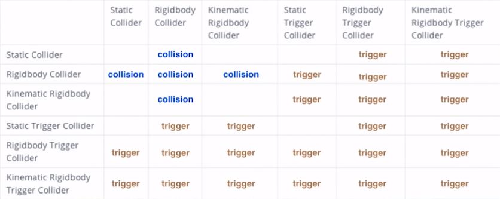

# Unity cheatsheet

## Collider Interaction Matrix


## UI
### RectTransform positioning
[How to set sizeDelta to position a RectTransform on UI](https://stackoverflow.com/a/44474228/5208606)

## Animations
### Interpolations
  * [Read this](https://chicounity3d.wordpress.com/2014/05/23/how-to-lerp-like-a-pro/) if you don't want to use plugins
  * But using [DOTweens](http://dotween.demigiant.com) is really faster (with [this cheasheet](https://easings.net/) of easing functions)
 

## Tips
  * Use [`[RuntimeInitializeOnLoadMethod]`](https://docs.unity3d.com/ScriptReference/RuntimeInitializeOnLoadMethodAttribute.html) tu run a method when game is initialized (without having to link the script to a gameObject)
  * Activate the `Debug` mode in the top right of the inspector to display private variables
  * Generate chart in realtime in the inspector with:
    ```
    public AnimationCurve curve = new AnimationCurve();
    void Update() {
      curve.AddKey(Time.realtimeSinceStartup, Mathf.Sin(Time.time));
    }
    ```
  * `Shift`+`F` to lock camera on an object in scene view
  * Add `[SelectionBase]` to a class to target this gameobject while clicking it in the scene view (instead of children)
  
  

## Optimization

### Script Optimization
  * It's more efficient to use [`gameObject.CompareTag`](https://docs.unity3d.com/ScriptReference/Component.CompareTag.html) than `==`
  
### [UI optimization](https://unity3d.com/fr/how-to/unity-ui-optimization-tips)

* **Diviser les canvas entre statiques et dynamiques**. Lorsqu'un élément du canvas change, tout le canvas est re-dessiné. [Source](https://youtu.be/_wxitgdx-UI?t=23m36s)
* Désactiver `Raycast Target` pour les éléments statiques ou non-interactifs.

## Logcat
**Use adb logcat :**
See [doc](https://developers.google.com/admob/android/test-ads)
Launch Command Prompt at adb.exe location (*C:\Users\[username]\AppData\Local\Android\android-sdk\platform-tools*) then type : 
```
adb logcat -s Unity ActivityManager PackageManager dalvikvm DEBUG
```

**Get device ID for AdMob :**
Launch Command Prompt at adb.exe location (*C:\Users\[username]\AppData\Local\Android\android-sdk\platform-tools*) then type : 
```
adb logcat -s "Ads"
```
(or without -s "Ads" to remove the filter) , then start ad request on the device. Watch for the line "Use AdRequest.Builder.addTestDevice("###########") to get test ads on this device." in the logs.
**Display Warnings and higher on logcat :**
```
adb logcat *:W
```